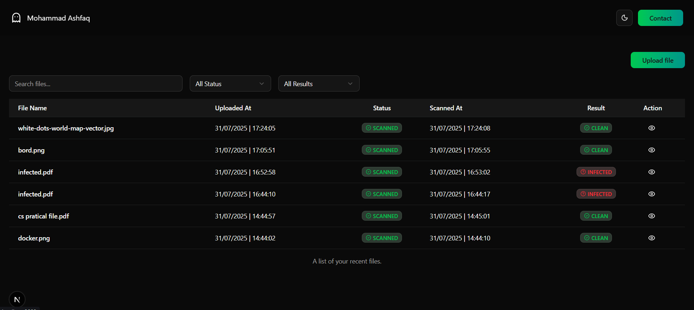

# 🛡️ File Scanner Full-Stack Application

This is a **full-stack file scanning application** that allows users to **upload files**, automatically **queue them for scanning**, and **view live results** on a real-time dashboard.

## 📁 Project Structure
- backend
- file-scanning-worker
- frontend 

---

## 🚀 Live Demo

🔗 [Live Site](https://cyberxplore-assignment.vercel.app/)

---

## 📸 Screenshots

### 🔼 Upload Page


### 📊 Dashboard Page


---

## 🛠️ Local Development Setup

To run the project locally, follow the steps below:

### 1. Clone the repository

```bash
git clone https://github.com/Ashfaqsidd47s/cyberxplore-assignment.git
cd cyberxplore-assignment
```

### 2. Setup all three apps
Each of the backend, file-scanning-worker, and frontend apps share the same setup:

```bash
Copy
Edit
cp .env.sample .env         # Copy the environment file
npm install                  # Install dependencies
npm run dev                  # Start the app in development mode
```
⚠️ Ensure all 3 folders are setup and running independently in separate terminals.

### 🧪 RabbitMQ Setup
If you don't have RabbitMQ installed locally, use the provided Docker setup in the backend folder:

Start RabbitMQ with Docker:
```bash
Copy
Edit
cd backend
docker compose up
```

## 📦 Tech Stack
| Layer         | Tech                       |
| ------------- | -------------------------- |
| Frontend      | Next.js, ShadCN UI         |
| Backend       | Node.js, Express, MongoDB  |
| Worker        | Node.js, RabbitMQ          |
| Communication | RabbitMQ (async messaging) |
| Realtime UI   | Polling via setInterval    |

## 📋 Features
- File upload with type validation
- Asynchronous malware scanning (simulated)
- Real-time dashboard with live status updates
- RabbitMQ setup
- Modular architecture with clear folder separation


## 📮 API Overview
| Endpoint        | Method | Description                      |
| --------------- | ------ | -------------------------------- |
| `/files/upload` | POST   | Upload a file and queue for scan |
| `/files`        | GET    | Fetch all uploaded file metadata |


